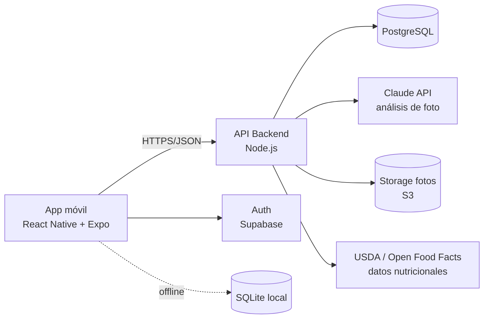

# FitFood — Plan de Desarrollo Completo

App móvil de nutrición inteligente: reconocimiento de comidas por foto, conteo de calorías y plan de alimentación personalizado. Funcionalidad inspirada en Fitia.

---

## 1. Visión y objetivos del producto

**Visión:** que registrar lo que comes tome segundos (una foto) en lugar de minutos (buscar y pesar cada ingrediente), y que la app te guíe activamente hacia tu objetivo físico.

**Objetivos del producto:**

1. Determinar las calorías y macronutrientes de una comida a partir de una foto, con posibilidad de corrección manual.
2. Generar un plan de gestión de calorías personalizado según peso, estatura, edad, sexo, nivel de actividad y objetivo (perder grasa, mantener, ganar músculo).
3. Hacer seguimiento diario de calorías, macros, agua y peso, con retroalimentación clara del progreso.
4. Experiencia rápida y sin fricción: el registro de una comida debe tomar menos de 15 segundos.

**Usuarios objetivo:** personas que quieren perder/ganar peso o mejorar composición corporal, de habla hispana primero (mercado de Fitia), sin conocimientos técnicos de nutrición.

---

## 2. Funcionalidades

### 2.1 MVP (versión 1.0)

| # | Funcionalidad | Descripción |
|---|--------------|-------------|
| F1 | Onboarding y perfil | Captura de sexo, edad, peso, estatura, nivel de actividad y objetivo. Cálculo automático de calorías y macros diarios. |
| F2 | Escaneo de comida por foto | Tomar/subir foto → IA identifica alimentos, estima porciones y devuelve calorías + macros. El usuario confirma o corrige. |
| F3 | Registro manual | Búsqueda en base de datos de alimentos (con datos por 100 g y por porción) y registro por porciones. |
| F4 | Diario de comidas | Desayuno / almuerzo / cena / snacks. Totales del día vs. meta, anillos de progreso de calorías y macros. |
| F5 | Plan de calorías | Meta calórica diaria y distribución de macros según objetivo, con ritmo de cambio de peso estimado (ej. −0.5 kg/semana). |
| F6 | Seguimiento de peso | Registro periódico de peso con gráfica de tendencia y recálculo automático del plan. |
| F7 | Cuentas y sincronización | Registro con email/Google/Apple, datos sincronizados en la nube. |

### 2.2 Versión 1.5

- Escáner de código de barras (Open Food Facts).
- Registro de agua y recordatorios.
- Alimentos favoritos, comidas frecuentes y "repetir comida de ayer".
- Modo offline con sincronización diferida.

### 2.3 Versión 2.0 (paridad con Fitia)

- **Generador de planes de comida:** menús diarios/semanales que cuadran con las calorías y macros del usuario, con recetas locales (comida latinoamericana).
- Registro de ejercicio e integración con Apple Health / Google Fit (ajuste de calorías por actividad).
- Recetas con instrucciones y lista de compras.
- Gamificación: rachas, logros, retos.
- Chat/asistente nutricional con IA.
- Suscripción premium.

---

## 3. Lógica de nutrición (el "cerebro" de la app)

### 3.1 Cálculo del gasto energético

**TMB (Tasa Metabólica Basal) — fórmula Mifflin-St Jeor** (estándar de la industria, la más precisa sin medir composición corporal):

- Hombres: `TMB = 10·peso(kg) + 6.25·estatura(cm) − 5·edad + 5`
- Mujeres: `TMB = 10·peso(kg) + 6.25·estatura(cm) − 5·edad − 161`

**GET (Gasto Energético Total) = TMB × factor de actividad:**

| Nivel | Factor |
|-------|--------|
| Sedentario (poco o nada de ejercicio) | 1.2 |
| Ligero (1–3 días/semana) | 1.375 |
| Moderado (3–5 días/semana) | 1.55 |
| Activo (6–7 días/semana) | 1.725 |
| Muy activo (trabajo físico + entrenamiento) | 1.9 |

### 3.2 Meta calórica según objetivo

| Objetivo | Ajuste | Ritmo esperado |
|----------|--------|----------------|
| Perder grasa | GET − 15 % a 25 % (déficit) | −0.25 a −0.75 kg/semana |
| Mantener | GET | 0 |
| Ganar músculo | GET + 10 % a 15 % (superávit) | +0.2 a +0.4 kg/semana |

Reglas de seguridad: nunca sugerir menos de 1,200 kcal/día (mujeres) o 1,500 kcal/día (hombres); validar IMC extremos y mostrar aviso de consultar a un profesional. La app no da consejo médico (disclaimer obligatorio).

### 3.3 Distribución de macronutrientes

- **Proteína:** 1.6–2.2 g/kg de peso (mayor en déficit para preservar músculo).
- **Grasa:** 20–30 % de las calorías totales (mínimo 0.6 g/kg).
- **Carbohidratos:** el resto de las calorías.
- Conversión: proteína 4 kcal/g, carbohidrato 4 kcal/g, grasa 9 kcal/g.

### 3.4 Ajuste adaptativo

Cada 1–2 semanas, comparar el cambio de peso real (promedio móvil de 7 días para suavizar fluctuaciones de agua) contra el esperado y ajustar la meta calórica ±5–10 %. Esto corrige el error inherente de las fórmulas y de la estimación por fotos.

---

## 4. Reconocimiento de comida por foto (IA)

### 4.1 Enfoque elegido: LLM multimodal (Claude API con visión)

El flujo:

1. La app comprime la foto (~1024 px, JPEG) y la envía al backend.
2. El backend llama a la API de Claude con la imagen y un prompt estructurado que pide JSON: lista de alimentos detectados, porción estimada en gramos, nivel de confianza, y calorías/macros por ítem.
3. El backend cruza cada alimento contra la base de datos nutricional para normalizar valores (la IA identifica y estima porciones; la BD da los números oficiales).
4. La app muestra el desglose editable: el usuario puede corregir alimento, porción o eliminar ítems antes de guardar.

**Por qué este enfoque y no un modelo propio de visión:**

| Criterio | LLM multimodal (elegido) | Modelo CNN propio |
|----------|--------------------------|-------------------|
| Tiempo a mercado | Días | Meses (dataset + entrenamiento) |
| Cobertura de platos | Miles, incluidos platos latinos compuestos | Limitado al dataset |
| Costo inicial | Pago por uso (~$0.01–0.02/foto) | Alto (GPU, ingeniería ML) |
| Estimación de porciones | Razonable con contexto visual | Requiere modelos adicionales |
| Mejora continua | Automática con nuevos modelos | Reentrenamiento manual |

A futuro (v2+), si el volumen lo justifica, se puede entrenar un modelo propio con las fotos corregidas por usuarios (con su consentimiento) para reducir costo por escaneo.

### 4.2 Manejo de incertidumbre

- Mostrar siempre la estimación como editable ("¿Es correcto?") — la corrección del usuario es parte del flujo, no una excepción.
- Si la confianza es baja, pedir confirmación explícita del alimento.
- Guardar foto + resultado + corrección como telemetría para medir y mejorar precisión.

### 4.3 Base de datos de alimentos

- **USDA FoodData Central** (dominio público, ~400k alimentos) como base.
- **Open Food Facts** para productos empaquetados y código de barras.
- **Tabla propia de platos latinoamericanos** (arepas, tacos, ceviche, arroz chaufa, etc.) — diferenciador clave frente a apps gringas, igual que Fitia.
- Alimentos creados por usuarios (privados, con opción de moderación para hacerlos públicos).

---

## 5. Arquitectura técnica

### 5.1 Stack

| Capa | Tecnología | Justificación |
|------|-----------|---------------|
| App móvil | **React Native + Expo** (TypeScript) | Un código para iOS y Android, ecosistema maduro, cámara/notificaciones resueltas por Expo, OTA updates. |
| Estado/datos en app | React Query + Zustand; SQLite (expo-sqlite) para offline | Cache y sincronización diferida. |
| Backend | **Node.js (NestJS o Fastify) + TypeScript** | Mismo lenguaje en todo el stack; el backend es mayormente CRUD + orquestación de IA. |
| Base de datos | **PostgreSQL** (gestionado: Supabase o RDS) | Relacional encaja con el modelo (usuarios, alimentos, registros); Supabase además da auth y storage. |
| Autenticación | Supabase Auth (email, Google, Apple) | Apple Sign-In es obligatorio en iOS si hay login social. |
| Almacenamiento de fotos | S3 / Supabase Storage (retención corta, 30 días) | Las fotos solo se necesitan para reprocesar/telemetría. |
| IA visión | **Claude API (modelo con visión)** vía backend | Nunca exponer la API key en la app. |
| Analítica / crashes | PostHog + Sentry | Medir embudo de registro de comidas y precisión del escaneo. |
| CI/CD | GitHub Actions + EAS Build/Submit | Builds y publicación automatizadas a las tiendas. |

### 5.2 Diagrama de alto nivel



### 5.3 Modelo de datos (tablas principales)

```
users            (id, email, nombre, sexo, fecha_nacimiento, estatura_cm, creado_en)
user_goals       (id, user_id, objetivo, peso_actual_kg, peso_meta_kg, nivel_actividad,
                  kcal_diarias, proteina_g, carbs_g, grasa_g, activo, creado_en)
foods            (id, nombre, marca, fuente, kcal_100g, proteina_100g, carbs_100g,
                  grasa_100g, porciones_json, codigo_barras, publico, creado_por)
meal_logs        (id, user_id, fecha, tipo_comida, creado_en)
meal_log_items   (id, meal_log_id, food_id, gramos, kcal, proteina_g, carbs_g, grasa_g,
                  origen: foto|manual|barcode, foto_url, confianza_ia, corregido_por_usuario)
weight_logs      (id, user_id, fecha, peso_kg)
water_logs       (id, user_id, fecha, ml)
scan_events      (id, user_id, foto_url, respuesta_ia_json, resultado_final_json,
                  latencia_ms, creado_en)   -- telemetría de precisión
```

### 5.4 API principal (REST)

```
POST /auth/*                      → delegado a Supabase
GET/PUT /me                       → perfil
POST /me/goals                    → crea/recalcula plan (devuelve kcal y macros)
POST /scans                       → sube foto, devuelve análisis IA (alimentos + macros)
GET  /foods?q=&barcode=           → búsqueda de alimentos
POST /foods                       → alimento creado por usuario
GET/POST /logs?date=              → diario de comidas
POST /weights, GET /weights       → peso
GET  /summary?date=               → totales del día vs. metas
```

---

## 6. Diseño UX — pantallas del MVP

1. **Onboarding (5 pasos):** objetivo → sexo/edad → peso/estatura → nivel de actividad → resultado ("Tu plan: 1,850 kcal, 140P/180C/62G") → crear cuenta. Registrar cuenta *al final*, después de mostrar valor.
2. **Home / Diario:** anillo grande de calorías restantes, barras de macros, secciones por comida con botón "+", acceso directo a cámara.
3. **Cámara / Escaneo:** captura → loading (2–4 s) → tarjeta de resultados con cada alimento, porción ajustable con slider/stepper y totales en vivo → "Agregar al diario".
4. **Búsqueda manual:** buscador con resultados instantáneos, recientes y favoritos.
5. **Progreso:** gráfica de peso con tendencia, historial de adherencia calórica semanal.
6. **Perfil/Ajustes:** editar datos → recalcula plan; unidades (kg/lb, cm/ft); recordatorios.

Principios: máximo 2 taps para llegar a la cámara; todo resultado de IA es editable; celebrar el registro (feedback positivo), nunca culpabilizar por excederse.

---

## 7. Fases de ejecución y cronograma

### Fase 0 — Fundaciones (Semana 1–2)
- Monorepo (`app/` Expo + `backend/` Node + `shared/` tipos TS).
- CI (lint, tests, typecheck), entornos dev/staging/prod, Supabase configurado.
- Importación inicial de base de datos de alimentos (USDA + tabla latina inicial).
- **Entregable:** esqueleto navegable de la app + API viva con auth.

### Fase 1 — Motor de nutrición y perfil (Semana 3–4)
- Onboarding completo, cálculo TMB/GET/macros (módulo puro con tests unitarios exhaustivos — es el corazón matemático).
- Pantalla de plan y edición de perfil con recálculo.
- **Entregable:** usuario crea su plan personalizado de calorías.

### Fase 2 — Diario y registro manual (Semana 5–6)
- Búsqueda de alimentos, registro por porciones, diario con totales y anillos de progreso.
- Registro y gráfica de peso.
- **Entregable:** app usable como contador de calorías manual (ya es útil sin IA).

### Fase 3 — Escaneo por foto (Semana 7–9)
- Pipeline foto → backend → Claude → normalización con BD → UI de corrección.
- Telemetría de precisión (scan_events), manejo de errores y baja confianza.
- Iteración de prompts con set de ~200 fotos de prueba de comida latina.
- **Entregable:** la funcionalidad estrella funcionando de punta a punta.

### Fase 4 — Pulido y beta (Semana 10–12)
- Modo offline básico, notificaciones de recordatorio, estados vacíos, i18n (es/en).
- Beta cerrada (TestFlight + Play Internal Testing) con 30–50 usuarios.
- Métricas objetivo de beta: >70 % de escaneos aceptados sin corrección mayor; registro de comida <15 s; retención D7 >30 %.
- **Entregable:** release candidate.

### Fase 5 — Lanzamiento (Semana 13–14)
- Ficha de tiendas, revisión de Apple/Google, políticas de privacidad, disclaimer de salud.
- **Entregable:** v1.0 en App Store y Google Play.

### Post-lanzamiento
- v1.5 (código de barras, agua, favoritos): +4 semanas.
- v2.0 (planes de comida generados, ejercicio, premium): +8–12 semanas.

---

## 8. Costos operativos estimados (MVP, ~1,000 usuarios activos)

| Concepto | Estimado mensual |
|----------|-----------------|
| Claude API (~10 escaneos/usuario/mes) | $100–200 USD |
| Supabase / PostgreSQL + Storage | $25–50 USD |
| Hosting backend (Railway/Fly/Render) | $20–40 USD |
| Apple Developer + Google Play | ~$12 USD (prorrateado) |
| Sentry + PostHog (tiers gratis al inicio) | $0 |
| **Total** | **~$150–300 USD/mes** |

Palanca de costo principal: el escaneo por foto. Mitigaciones: comprimir imágenes, cachear platos repetidos del mismo usuario, y en premium ilimitado / gratis con límite diario (modelo freemium igual que Fitia).

---

## 9. Privacidad, seguridad y cumplimiento

- Datos de salud (peso, objetivos) → cifrado en tránsito (TLS) y en reposo; acceso por row-level security.
- Fotos: retención máxima 30 días salvo consentimiento explícito para mejorar el modelo; opción de borrado total de cuenta (requisito de las tiendas).
- Consentimiento claro de que las fotos se procesan con IA de terceros.
- Disclaimer visible: la app no sustituye consejo médico o nutricional profesional; bloqueo de metas peligrosas (ver §3.2).
- Cumplimiento GDPR-like (varios países LATAM tienen leyes de protección de datos: Ley 1581 Colombia, LFPDPPP México, LGPD Brasil).

---

## 10. Riesgos y mitigaciones

| Riesgo | Prob. | Impacto | Mitigación |
|--------|-------|---------|------------|
| Precisión insuficiente del escaneo (porciones) | Alta | Alto | UI de corrección como flujo normal; ajuste adaptativo del plan (§3.4) compensa el error promedio; telemetría para iterar prompts. |
| Costo de IA crece con el uso | Media | Medio | Límite en tier gratis, caché de platos repetidos, migrar a modelo más económico/propio a escala. |
| Rechazo en revisión de tiendas (categoría salud) | Media | Alto | Disclaimers, política de privacidad completa, sin claims médicos. |
| Base de datos pobre en comida latina | Media | Alto | Curaduría propia desde el día 1 + alimentos de usuarios. |
| Competencia (Fitia, MyFitnessPal, Cal AI) | Alta | Medio | Diferenciación: escaneo IA + comida latina + UX en español + precio local. |

---

## 11. Métricas de éxito

- **Activación:** % de usuarios que completan onboarding y registran su primera comida (meta: >60 %).
- **Precisión IA:** % de escaneos aceptados sin corrección de alimento (meta: >70 %); error calórico mediano vs. corrección (<20 %).
- **Retención:** D7 >30 %, D30 >15 % (estándar de apps de fitness).
- **Resultado del usuario:** % de usuarios activos 8+ semanas cuya tendencia de peso va en dirección de su objetivo.

---

## 12. Estructura del repositorio propuesta

```
FitFood/
├── app/                  # React Native + Expo (TypeScript)
│   ├── src/
│   │   ├── screens/      # onboarding, diario, cámara, progreso, perfil
│   │   ├── components/
│   │   ├── services/     # cliente API, cámara, notificaciones
│   │   ├── store/        # Zustand + React Query
│   │   └── db/           # SQLite offline
├── backend/              # Node.js + TypeScript
│   ├── src/
│   │   ├── modules/      # auth, profile, goals, foods, logs, scans
│   │   ├── nutrition/    # motor TMB/GET/macros (puro, 100% testeado)
│   │   ├── vision/       # integración Claude, prompts, normalización
│   │   └── db/           # migraciones, seeds (USDA, comida latina)
├── shared/               # tipos TS compartidos (contratos API)
└── docs/                 # este plan, decisiones de arquitectura (ADRs)
```

---

## Próximo paso

Con este plan aprobado, la ejecución comienza por la **Fase 0**: montar el monorepo, el esqueleto de la app Expo, el backend con auth y la primera migración de base de datos.
